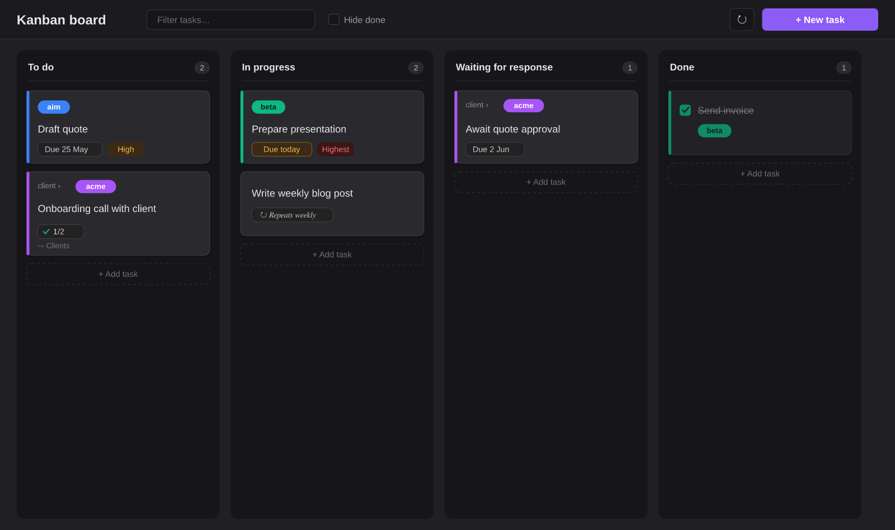
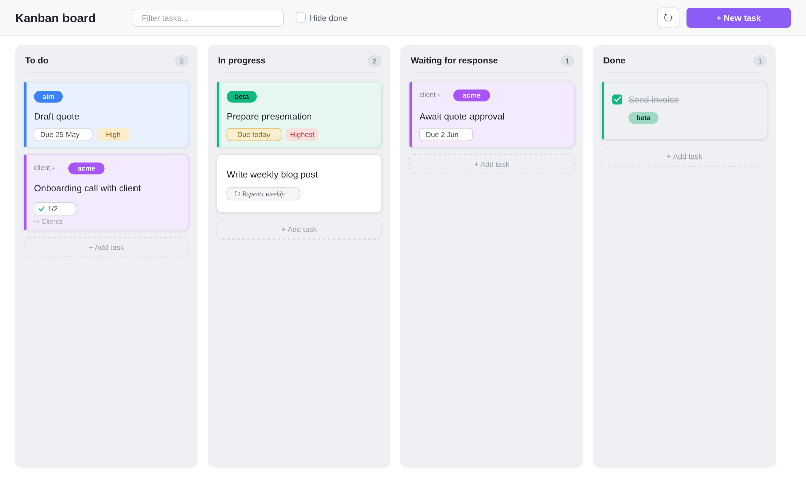
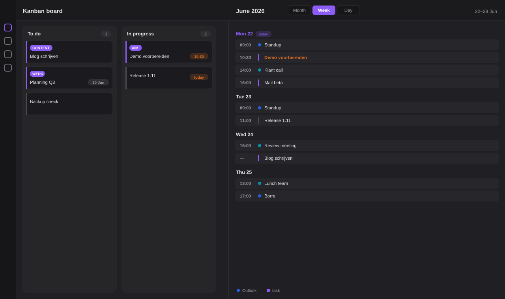
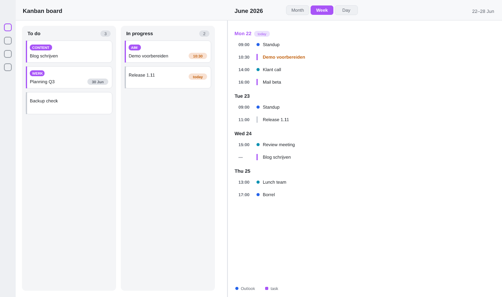
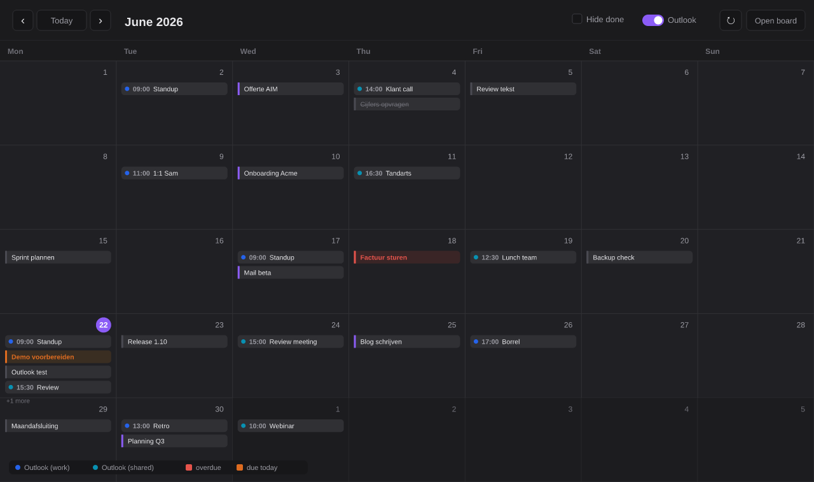
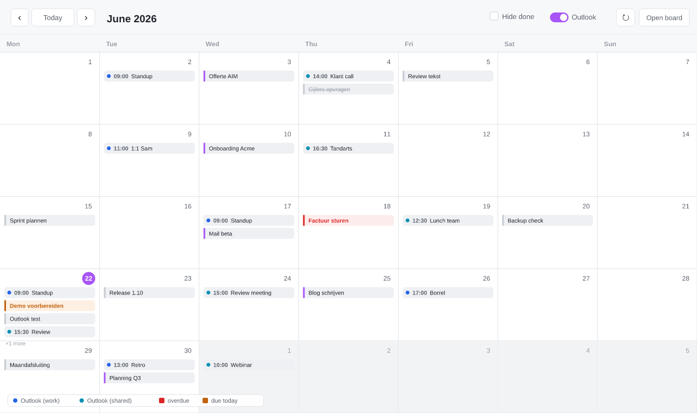
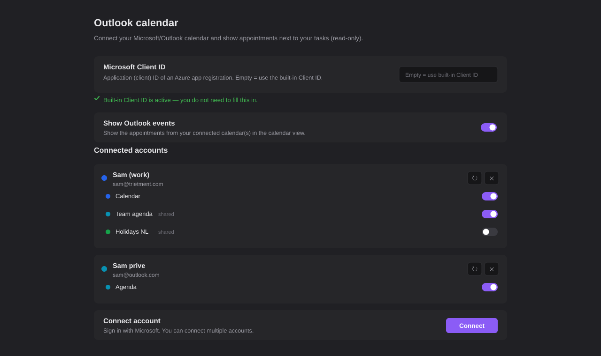
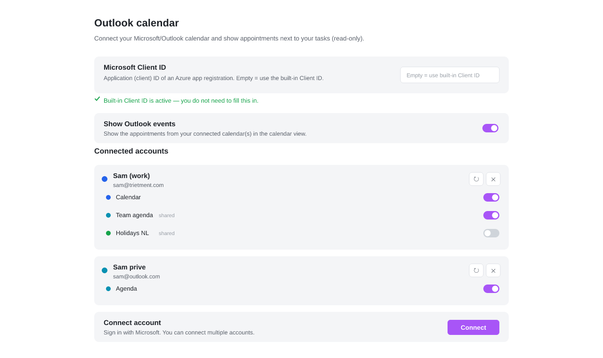

# Trietment Kanban

**English** | [Nederlands](#nederlands)

A Kanban board for [Obsidian](https://obsidian.md) that collects tasks from **every note in your vault**. Tasks are plain markdown checkboxes with optional metadata; the plugin shows them as draggable cards in columns. Works on desktop and mobile.


<a href="https://buymeacoffee.com/trietment" target="_blank"></a>

If you find this plugin useful, you can [buy me a coffee](https://buymeacoffee.com/trietment) — thank you!





### New in 1.11 — Week & day views, times on cards, and note archiving

The calendar now has **Week** and **Day** views next to Month; you can give a task a **time** that appears on one timeline with your appointments; and a completed card can **archive its linked note** automatically. Below: the board next to the Week agenda with Outlook events and timed tasks on one timeline, plus the month calendar and Outlook sync introduced in 1.10.













## Features

- **Tasks from your whole vault** — every `- [ ]` checkbox with a `#kanban/` tag appears on the board.
- **Dynamic columns** — defaults: To do / In progress / Waiting for response / Done. Add, rename, reorder or remove columns in the settings. Drag cards between columns (desktop) or change the column in the edit modal (mobile).
- **Bilingual (EN/NL)** — the whole interface is available in English and Dutch. By default the plugin follows the Obsidian language; you can also choose manually.
- **Projects with colors** — group with `#project/name`, each with its own color and optional label. Subprojects (`#project/client/acme`) are supported.
- **Clients** — a second colored tag dimension with `#client/name` alongside the project, so a card can carry both a client and a project.
- **Swimlanes** — group cards into horizontal lanes by project, client, priority or due date via the board header's "Group by" control.
- **Multiple boards** — create named boards, each scoped to certain projects/clients with its own lane grouping; switch boards from the header.
- **Card covers** — show an image (`[cover:: [[logo.png]]]` or a URL) or a plain-text banner on a card; upload an image with one click.
- **Due dates, times & recurrence** — `📅 2026-05-28`, an optional time `⏰ 14:30`, and `🔁 every week`. Completed recurring tasks automatically create the next instance (keeping their time).
- **Calendar view (Month / Week / Day)** — see every task on its due date, with the same color coding as the board (red = overdue, orange = today). Switch between a month grid and agenda-style Week and Day views from the header; tasks with a time and your appointments share one timeline sorted by time. In the month view, **"+N more" is clickable** and opens that day so nothing stays hidden. The views stay readable in a narrow split pane. Open the calendar from the ribbon (calendar icon), the command palette, or the 📅 button on the board. Click a day to add a task with that date prefilled; click a task to edit it.
- **Outlook calendar (optional)** — connect one or more Microsoft/Outlook accounts via OAuth and see your appointments next to your tasks in the calendar view (read-only). Pick exactly which calendars to show per account, including shared calendars. See [Outlook setup](#outlook-calendar-setup).
- **Customizable priorities** — define your own priority list (name + color) in the settings, or use the built-in `🔺 ⏫ 🔼 🔽 ⏬`. Cards show a colored priority pill.
- **Subtasks** — indented checkboxes under a task. The board shows a `☑ 2/5` progress badge; add and check them in the edit modal.
- **Linked note per card** — use the 📄 button to create a dedicated note for a task from a template (a `[[wikilink]]` in the task line). If it already exists, the button opens it. Optionally, completing a card moves its note into a `0. archive` subfolder (and reopening moves it back).
- **Click = edit** — click a card for the edit modal: status/column, due date, project, recurrence, subtasks and note in one place.
- **Automatic moving** — tasks due today (or overdue) move automatically to the In-progress column.
- **Inbox** — quick entry of new tasks into a configurable inbox note.
- **Collect from #kanban notes (optional)** — tag a note with `#kanban` and all its checkboxes appear on the board without per-task tags, scoping the board to your #kanban notes (new tasks land in the Inbox to sort, done ones in the done column).

## Installation

### From Obsidian's community plugins (recommended)

1. Open **Settings → Community plugins** and make sure community plugins are enabled.
2. Click **Browse** and search for **Trietment Kanban**.
3. Click **Install**, then **Enable**.

Works the same on desktop and mobile. Obsidian offers updates automatically.

### Manually

1. Create the folder `<vault>/.obsidian/plugins/trietment-kanban/`.
2. Copy `main.js`, `manifest.json` and `styles.css` from the [latest release](https://github.com/Trietment/obsidian-kanban/releases) into it.
3. Restart Obsidian and enable the plugin under Settings → Community plugins.

## Task syntax

A task is a plain markdown checkbox with optional metadata:

```text
- [ ] Draft quote 📅 2026-05-25 ⏰ 09:30 #project/aim #kanban/doing ⏫
    - [ ] Request figures
    - [x] Pick template
- [ ] Onboarding call [[Acme onboarding]] #project/client/acme #kanban/todo
- [x] Mail sent #project/client/beta #kanban/done
```

| Part | Meaning |
|---|---|
| `#kanban/<column>` | Which column the task is in (e.g. `#kanban/doing`) |
| `#project/<name>` | Project; use `/` for subprojects (`#project/client/acme`) |
| `#client/<name>` | Client — a second colored tag dimension shown alongside the project |
| `📅 YYYY-MM-DD` | Due date |
| `⏰ HH:mm` | Time of day (24h), shown on the calendar timeline |
| `🔁 every week` | Recurrence (`every day/week/month/year`, also `every 2 weeks`) |
| `🔺 ⏫ 🔼 🔽 ⏬` | Priority (highest → lowest) |
| `[[Note]]` | Linked note |
| `[cover:: …]` | Card cover — an image (`[[file]]` or URL) or plain text |
| indented `- [ ]` | Subtask of the task above it |

You can put tasks in **any** note in your vault — they are picked up automatically.

### Styling cards with CSS

Card metadata is rendered with `data-field` / `data-value` attributes, so you can style values from a [CSS snippet](https://help.obsidian.md/snippets) (Settings → Appearance → CSS snippets) — for example, turn priorities into colored pills:

```css
.tk-prio { padding: 1px 8px; border-radius: 999px; }
.tk-prio[data-value="highest"] { background: var(--color-red); color: #fff; }
.tk-prio[data-value="low"]     { background: var(--color-green); color: #fff; }
```

Each meta element (`.tk-prio`, `.tk-due`, `.tk-recur`, the project badge) carries `data-field` + `data-value`, and the card carries `data-column`, `data-priority` and `data-project`.

## Usage

- **+ New task** (or the `+` under a column) adds a task, by default in the inbox note.
- **Click a card** → edit modal with column/status, due date, project, recurrence, subtasks and the linked note.
- **📄** creates/opens the linked note; **☑ 2/5** shows subtask progress.
- **Drag** a card to another column (desktop) to update the `#kanban/` tag.
- Click a **project badge** to filter on that project.

## Settings

- Add/rename/remove/reorder columns, default column, done column, inbox note, show inbox column.
- Automatic moving (today → In progress, optionally also overdue).
- Language (automatic / Dutch / English).
- Projects & colors, with a button to scan the vault (or only specific scan folders) for `#project/` tags.
- Linked notes: note folder and template file (empty = built-in template).
- Outlook calendar: Microsoft Client ID, show events toggle, connected accounts.

## Outlook calendar setup

The Outlook integration uses OAuth 2.0 (Authorization Code + PKCE) and Microsoft Graph. It is read-only — appointments are shown next to your tasks, nothing is written back.

1. Go to the [Microsoft Entra admin center](https://entra.microsoft.com) → **App registrations** → **New registration**.
2. Choose a supported account type. For personal and work/school accounts across organizations, pick *Accounts in any organizational directory and personal Microsoft accounts*.
3. Under **Authentication → Add a platform → Mobile and desktop applications**, add the redirect URI `obsidian://trietment-kanban-auth`, and enable **Allow public client flows**.
4. Under **API permissions**, add the delegated Microsoft Graph permissions `User.Read`, `Calendars.Read`, `Calendars.Read.Shared` and `offline_access`.
5. Copy the **Application (client) ID** and paste it into the plugin settings (Outlook calendar → Microsoft Client ID).
6. Click **Connect** and sign in. Repeat to connect multiple accounts.
7. Under each connected account, use the calendar picker to choose which calendars to show. Shared calendars appear once you have added them in Outlook; use the refresh button to reload the list. Each calendar gets its own color.

Sign-in tokens are stored per device (in local storage, not in `data.json`), so they are never copied by Obsidian Sync — you sign in once per device. Work/school accounts may require admin consent depending on your organization.

## Files

- `main.js` — the plugin
- `manifest.json` — plugin metadata
- `styles.css` — styling
- `versions.json` — version ↔ minimum Obsidian version

> `data.json` (your personal settings and project colors) belongs to your vault and is deliberately **not** in this repo.

## License

[MIT](LICENSE).

---

# Nederlands

[English](#trietment-kanban) | **Nederlands**

Een Kanban-bord voor [Obsidian](https://obsidian.md) dat taken verzamelt uit **alle notes in je vault**. Taken zijn gewone markdown-checkboxes met optionele metadata; de plugin toont ze als sleepbare kaarten in kolommen. Werkt op desktop én mobiel.


<a href="https://buymeacoffee.com/trietment" target="_blank"></a>

Vind je deze plugin handig? Je kunt me [een koffie trakteren](https://buymeacoffee.com/trietment) — dankjewel!


### Nieuw in 1.11 — Week- & dagweergave, tijd op kaarten, en notities archiveren

De kalender heeft nu **Week**- en **Dag**weergave naast Maand; je kunt een taak een **tijd** geven die op één tijdlijn met je afspraken verschijnt; en een afgeronde kaart kan zijn **gekoppelde notitie automatisch archiveren**. Hieronder: het bord naast de Week-agenda met Outlook-afspraken en getimede taken op één tijdlijn, plus de maandkalender en Outlook-sync uit 1.10.


## Functies

- **Taken uit je hele vault** — elke `- [ ]` checkbox met een `#kanban/`-tag verschijnt op het bord.
- **Dynamische kolommen** — standaard: Te doen / Bezig / Wacht op reactie / Klaar. Voeg in de instellingen zelf kolommen toe, hernoem ze, wijzig de volgorde of verwijder ze. Sleep kaarten tussen kolommen (desktop) of wijzig de kolom in de edit-modal (mobiel).
- **Tweetalig (NL/EN)** — de hele interface is beschikbaar in het Nederlands en het Engels. Standaard volgt de plugin de taal van Obsidian; je kunt ook handmatig kiezen.
- **Projecten met kleuren** — groepeer met `#project/naam`, elk met eigen kleur en optioneel label. Subprojecten (`#project/klant/acme`) worden ondersteund.
- **Klanten** — een tweede gekleurde tag-dimensie met `#client/naam` naast het project, zodat een kaart zowel een klant als een project kan dragen.
- **Swimlanes** — groepeer kaarten in horizontale banen op project, klant, prioriteit of datum via de "Groeperen in banen"-keuze in de bordkop.
- **Meerdere borden** — maak benoemde borden, elk afgebakend op bepaalde projecten/klanten met een eigen banen-groepering; wissel bovenaan het bord.
- **Kaart-covers** — toon een afbeelding (`[cover:: [[logo.png]]]` of een URL) of platte tekst op een kaart; upload een afbeelding met één klik.
- **Due dates, tijd & herhaling** — `📅 2026-05-28`, een optionele tijd `⏰ 14:30`, en `🔁 every week`. Afgevinkte herhalende taken maken automatisch de volgende instance aan (met behoud van hun tijd).
- **Kalenderweergave (Maand / Week / Dag)** — zie elke taak op zijn due date, met dezelfde kleurcodering als het bord (rood = te laat, oranje = vandaag). Schakel in de kop tussen het maandraster en agenda-achtige Week- en Dagweergave; taken met een tijd en je afspraken delen één tijdlijn op tijd gesorteerd. In de maandweergave is **"+N meer" klikbaar** en opent die dag, zodat niets verborgen blijft. De weergaven blijven leesbaar in een smal split-paneel. Open de kalender via het lint (kalender-icoon), het commandopalet of de 📅-knop op het bord. Klik op een dag om een taak met die datum toe te voegen; klik op een taak om hem te bewerken.
- **Outlook-agenda (optioneel)** — koppel een of meer Microsoft/Outlook-accounts via OAuth en zie je afspraken naast je taken in de kalenderweergave (alleen-lezen). Kies per account precies welke agenda's je toont, inclusief gedeelde agenda's. Zie [Outlook instellen](#outlook-agenda-instellen).
- **Aanpasbare prioriteiten** — stel je eigen prioriteitenlijst in (naam + kleur) in de instellingen, of gebruik de ingebouwde `🔺 ⏫ 🔼 🔽 ⏬`. Kaarten tonen een gekleurde prioriteit-pil.
- **Subtaken** — ingesprongen checkboxes onder een taak. Het bord toont een `☑ 2/5`-voortgangsbadge; toevoegen en afvinken doe je in de edit-modal.
- **Gekoppelde notitie per kaart** — met de 📄-knop maak je uit een template een eigen notitie voor een taak (een `[[wikilink]]` in de taakregel). Bestaat hij al, dan opent de knop hem. Optioneel verhuist het afronden van een kaart zijn notitie naar een submap `0. archive` (en bij heropenen weer terug).
- **Klik = bewerken** — klik op een kaart voor de edit-modal: status/kolom, due date, project, herhaling, subtaken en notitie op één plek.
- **Automatisch verplaatsen** — taken die vandaag (of overdue) due zijn schuiven automatisch naar de Bezig-kolom.
- **Inbox** — snelle invoer van nieuwe taken in een instelbare inbox-note.
- **Verzamelen uit #kanban-notities (optioneel)** — tag een notitie met `#kanban` en al haar checkboxes verschijnen op het bord zonder per-taak-tag, waarmee je het bord beperkt tot je #kanban-notities (nieuwe taken komen in de Inbox om te sorteren, afgevinkte in de afgerond-kolom).

## Installatie

### Via de community-plugins (aanbevolen)

1. Open **Instellingen → Community-plugins** en zorg dat community-plugins aan staan.
2. Klik op **Bladeren** en zoek **Trietment Kanban**.
3. Klik op **Installeren** en daarna **Inschakelen**.

Werkt hetzelfde op desktop en mobiel. Obsidian biedt updates automatisch aan.

### Handmatig

1. Maak de map `<vault>/.obsidian/plugins/trietment-kanban/`.
2. Kopieer daarin `main.js`, `manifest.json` en `styles.css` uit de [laatste release](https://github.com/Trietment/obsidian-kanban/releases).
3. Herstart Obsidian en zet de plugin aan bij Instellingen → Community-plugins.

## Taaksyntaxis

Een taak is een gewone markdown-checkbox met optionele metadata:

```text
- [ ] Offerte uitwerken 📅 2026-05-25 ⏰ 09:30 #project/aim #kanban/doing ⏫
    - [ ] Cijfers opvragen
    - [x] Template kiezen
- [ ] Onboarding-call [[Acme onboarding]] #project/klant/acme #kanban/todo
- [x] Mail verstuurd #project/klant/beta #kanban/done
```

| Onderdeel | Betekenis |
|---|---|
| `#kanban/<kolom>` | In welke kolom de taak staat (bv. `#kanban/doing`) |
| `#project/<naam>` | Project; gebruik `/` voor subprojecten (`#project/klant/acme`) |
| `#client/<naam>` | Klant — een tweede gekleurde tag-dimensie naast het project |
| `📅 JJJJ-MM-DD` | Due date |
| `⏰ UU:mm` | Tijdstip (24-uurs), getoond op de kalender-tijdlijn |
| `🔁 every week` | Herhaling (`every day/week/month/year`, ook `every 2 weeks`) |
| `🔺 ⏫ 🔼 🔽 ⏬` | Prioriteit (hoogst → laagst) |
| `[[Notitie]]` | Gekoppelde notitie |
| `[cover:: …]` | Kaart-cover — een afbeelding (`[[bestand]]` of URL) of platte tekst |
| ingesprongen `- [ ]` | Subtaak van de taak erboven |

Je kunt taken in **elke** note van je vault zetten — ze worden vanzelf opgepikt.

### Kaarten stylen met CSS

Metadata op een kaart krijgt `data-field` / `data-value`-attributen, zodat je waarden vanuit een [CSS-snippet](https://help.obsidian.md/snippets) (Instellingen → Weergave → CSS-snippets) kunt stylen — bijvoorbeeld prioriteiten als gekleurde pillen:

```css
.tk-prio { padding: 1px 8px; border-radius: 999px; }
.tk-prio[data-value="highest"] { background: var(--color-red); color: #fff; }
.tk-prio[data-value="low"]     { background: var(--color-green); color: #fff; }
```

Elk meta-element (`.tk-prio`, `.tk-due`, `.tk-recur`, de project-badge) draagt `data-field` + `data-value`, en de kaart draagt `data-column`, `data-priority` en `data-project`.

## Gebruik

- **+ Nieuwe taak** (of het `+` onder een kolom) voegt een taak toe, standaard in de inbox-note.
- **Klik op een kaart** → edit-modal met kolom/status, due date, project, herhaling, subtaken en de gekoppelde notitie.
- **📄** maakt/opent de gekoppelde notitie; **☑ 2/5** toont de subtaak-voortgang.
- **Sleep** een kaart naar een andere kolom (desktop) om de `#kanban/`-tag bij te werken.
- Klik op een **project-badge** om op dat project te filteren.

## Instellingen

- Kolommen toevoegen/hernoemen/verwijderen/herordenen, standaardkolom, klaar-kolom, inbox-note, inbox-kolom tonen.
- Automatisch verplaatsen (vandaag → Bezig, optioneel ook overdue).
- Taal (automatisch / Nederlands / Engels).
- Projecten & kleuren, met een knop om de vault (of alleen bepaalde scan-mappen) te scannen op `#project/`-tags.
- Gekoppelde notities: notitie-map en template-bestand (leeg = ingebouwde template).
- Outlook-agenda: Microsoft Client ID, events-toggle, gekoppelde accounts.

## Outlook-agenda instellen

De Outlook-koppeling gebruikt OAuth 2.0 (Authorization Code + PKCE) en Microsoft Graph. Het is alleen-lezen — afspraken worden naast je taken getoond, er wordt niets teruggeschreven.

1. Ga naar het [Microsoft Entra-beheercentrum](https://entra.microsoft.com) → **App-registraties** → **Nieuwe registratie**.
2. Kies een ondersteund accounttype. Voor persoonlijke én werk-/schoolaccounts over meerdere organisaties: *Accounts in elke organisatiemap en persoonlijke Microsoft-accounts*.
3. Onder **Verificatie → Een platform toevoegen → Mobiele en desktop-applicaties** voeg je de redirect-URI `obsidian://trietment-kanban-auth` toe en zet je **Openbare clientstromen toestaan** aan.
4. Onder **API-machtigingen** voeg je de gedelegeerde Microsoft Graph-rechten `User.Read`, `Calendars.Read`, `Calendars.Read.Shared` en `offline_access` toe.
5. Kopieer de **Application (client) ID** en plak die in de plugin-instellingen (Outlook-agenda → Microsoft Client ID).
6. Klik op **Koppelen** en meld je aan. Herhaal dit om meerdere accounts te koppelen.
7. Onder elk gekoppeld account kies je met de agenda-kiezer welke agenda's je toont. Gedeelde agenda's verschijnen zodra je ze in Outlook hebt toegevoegd; gebruik de vernieuwen-knop om de lijst opnieuw te laden. Elke agenda krijgt een eigen kleur.

Aanmeld-tokens worden per apparaat bewaard (in lokale opslag, niet in `data.json`), zodat Obsidian Sync ze niet meeneemt — je meldt je één keer per apparaat aan. Werk-/schoolaccounts vereisen soms goedkeuring van de beheerder, afhankelijk van je organisatie.

## Bestanden

- `main.js` — de plugin
- `manifest.json` — plugin-metadata
- `styles.css` — styling
- `versions.json` — versie ↔ minimale Obsidian-versie

> `data.json` (je persoonlijke instellingen en projectkleuren) hoort bij je vault en zit bewust **niet** in deze repo.

## Licentie

[MIT](LICENSE).
